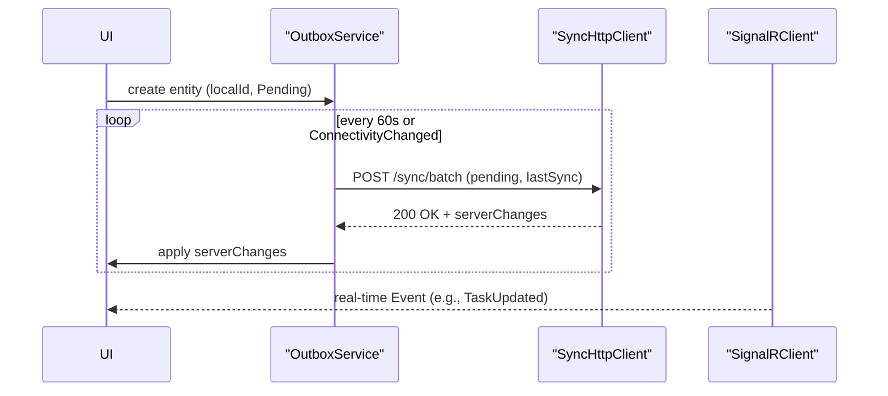

# HairCare+ — Core Development Guidelines

> Version: 2.1   |  Last update: July 2025

## Table of Contents
1. [Overview](#overview)
2. [Project Structure](#project-structure)
3. [Feature Scaffolding Convention](#feature-scaffolding-convention)
4. [Tech Stack](#tech-stack)
5. [Architecture Principles](#architecture-principles)
6. [MAUI UI Guidelines](#maui-ui-guidelines)
7. [Cross-cutting Policies](#cross-cutting-policies)
8. [Key References](#key-references)
9. [Data Synchronization Strategy](#data-synchronization-strategy)

## Overview
- **Mission:** Reduce post-surgery anxiety by empowering patients via gamified daily tasks, real-time chat, notifications, and rich media tracking.
- **Platforms:**
  - **Patient App (MAUI)**
  - **Clinic App (MAUI)**
  - **Server (ASP.NET Core + SignalR)**

### Application Descriptions
1. **Patient Mobile Application (MAUI)**
   - Patient profile management
   - Local storage and data synchronization
   - Real-time chat with clinic (local history caching)
   - Daily calendar tasks & notifications (offline-first support)
   - Photo/video playback and AR-based capture tools
   - Future integration with Server and Clinic apps

2. **Server Application**
   - Central communication hub and synchronization service
   - Authentication and security (JWT, HTTPS)
   - Data sync with clients and cloud storage integration
   - Real-time SignalR hub for notifications and chat

3. **Clinic Mobile Application (MAUI)**
   - Clinic staff and patient management
   - Patient monitoring, analytics, and reporting (local cache)
   - Treatment plan management and scheduling
   - Real-time chat & notifications (history caching)
   - AI-powered diagnostics and decision support

## Project Structure
```
src/
  Client/
    HairCarePlus.Client.Patient/
    HairCarePlus.Client.Clinic/
  Server/
    HairCarePlus.Server.*
  Shared/
    HairCarePlus.Shared.*
```

## Feature Scaffolding Convention
Each client feature follows Clean Architecture layers:
```
HairCarePlus.Client.[App]/
  Features/
    <FeatureName>/
      Application/   # CQRS commands, queries, handlers
      Domain/        # Feature-level domain objects
      Services/      # Interfaces + implementations
      ViewModels/
      Views/
      doc/           # Feature docs & UX specs
Client/Infrastructure/     # Shared concerns (Connectivity, Storage)
Client/Common/             # Reusable UI components
```

## Tech Stack
- **.NET SDK:** 9.0.200
- **.NET MAUI:** 9.0.51 SR
- **ASP.NET Core + SignalR**
- **Entity Framework Core**
- **ReactiveUI:** 19.5.41 (Calendar module)
- **DynamicData:** 8.3.27 (Reactive collections)

## Architecture Principles
- **Clean Architecture:** UI → Application → Domain → Shared Kernel
- **MVVM** for UI layering
- **CQRS:**
  - Commands **mutate** state
  - Queries **read** state
- **SOLID** & **KISS**

## MAUI UI Guidelines
- Use **Shell**, **CollectionView**, **Border**, **VisualStateManager**
- Enable **compiled bindings** (`x:DataType`)
- Theme via **ResourceDictionary** & **AppThemeBinding**
- Use **SwipeView** and **CommunityToolkit.TouchBehavior**
- Log via `ILogger<T>` (no `Debug.WriteLine`)
- Minimalistic design: flat borders, ≤2 accent colors, avoid overdraw

## Cross-cutting Policies
- **Security:** JWT, HTTPS, Secure Storage
- **Testing:** `dotnet test` must pass locally & in CI
- **CI/CD:** build, lint, test on PR; treat warnings as errors
- **Documentation:** keep `doc/*.md` in sync

## Key References
- [README](README.md)
- [Today Page Documentation](src/Client/HairCarePlus.Client.Patient/Features/Calendar/doc/todaypage.md)
- [Calendar Overview](src/Client/HairCarePlus.Client.Patient/Features/Calendar/doc/overview.md)
- [Chat Module](src/Client/HairCarePlus.Client.Patient/Features/Chat/doc/chat.md)
- [Notifications Module](src/Client/HairCarePlus.Client.Patient/Features/Notifications/doc/notifications.md)
- [Photo Capture Module](src/Client/HairCarePlus.Client.Patient/Features/PhotoCapture/doc/photo_capture.md)
- [Progress Module](src/Client/HairCarePlus.Client.Patient/Features/Progress/doc/progress.md)

## Data Synchronization Strategy

HairCare+ использует **«локальный кэш + короткие сетевые транзакции»** для надёжной работы в офлайне.

### Категории данных
| Тип | Где «главная» копия | TTL на сервере |
|-----|---------------------|----------------|
| ChatMessage | SQLite на устройствах; транзит через SignalR | 0 — не хранится |
| TaskReport (done/skip + note) | SQLite на устройствах | ≤ 14 дней (до ACK от получателей) |
| PhotoReport (image + comment) | Файл + SQLite на устройствах | ≤ 14 дней (до ACK) |
| CalendarTask (doctor-side edits) | SQLite на устройствах | ≤ 14 дней (до ACK) |

### Транспортные каналы
1. **REST Batch-Sync API** (`/sync/batch`) – JSON с изменениями всех сущностей, используется по таймеру и при появлении сети.
2. **SignalR Hub** (`/events`) – push-события в группах `patient-{id}` для мгновенного обновления (Chat, TaskUpdated, ReportAdded, CalendarChanged).

### Алгоритм клиента

* Все локальные объекты имеют `SyncStatus` (`Pending|Sent|Acked`).
* Сервер подтверждает успех, после чего записи помечаются `Acked`.
* Конфликты решаются правилом «новее по ModifiedAtUtc», при споре UI показывает баннер «требует подтверждения».

### Чат без хранения
* `SendChatMessageCommand` кладёт объект в Outbox и одновременно вызывает `Hub.SendAsync`.
* Получатель шлёт `Ack` назад → сообщение помечается `Delivered`.
* Если ACK не пришёл 30 сек – Polly retry.

### Роль сервера
* Не является долговременным хранилищем. Сохраняет изменения в DeliveryQueue до их доставки.
* Для Chat использует Redis (TTL 30 мин) как буфер, если получатель временно offline.

### Push-будилка (опц.)
* При новой записи сервер шлёт silent push через APNs/FCM – гарантирует, что офлайн-клиент проснётся и выполнит sync.

Эта модель минимальна, масштабируется и остаётся в рамках требования **«чат не хранить на сервере»**.

## Local Full-Stack Setup (2025-06)

### Prerequisites
1. .NET SDK 9.0.200 + MAUI workload (`dotnet workload install maui`).
2. Xcode 15 or newer with iOS 16+ simulators.
3. Physical iPhone (for Patient-app) OR iOS simulator.
4. macOS 13+.

### Launch all three entry points
Use the cross-platform launcher script:
```bash
chmod +x dev/run-haircare+.sh      # one-time
export CLINIC_SIM_UDID=<sim-udid>  # optional – run Clinic in simulator
./dev/run-haircare+.sh
```
Script details:
* Starts API Server on `0.0.0.0:5281` (HTTP) and exports `CHAT_BASE_URL` env var.
* Launches **Clinic** client:
  * macOS → Mac Catalyst by default.
  * `CLINIC_SIM_UDID` set → iOS simulator (`net9.0-ios`).
* Launches **Patient** client on attached iPhone (`RuntimeIdentifier=ios-arm64`).
* Gracefully terminates on `Ctrl + C`, cleaning all subprocesses.

## Current Feature Matrix
| Module | Patient App | Clinic App |
|--------|-------------|------------|
| Calendar / Today page | ✅ | ⭕ (analytics only) |
| Real-time Chat (SignalR) | ✅ send / reply / edit / delete | ✅ send / reply / delete |
| Notifications | ✅ local / push | ✅ incoming |
| Photo Capture & Preview | ✅ | 🔜 |
| Progress Tracking | ✅ | 🔜 |

---

# Clinic Application – Feature Docs
Docs for each Clinic feature live under `src/Client/HairCarePlus.Client.Clinic/Features/*/doc`.

* [Chat](src/Client/HairCarePlus.Client.Clinic/Features/Chat/doc/chat.md)
* Notifications – _TBD_
* Calendar / Tasks – _TBD_

👍  Follow the rules above, keep the codebase clean, and happy shipping!